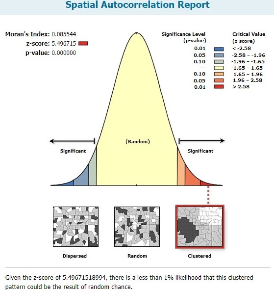
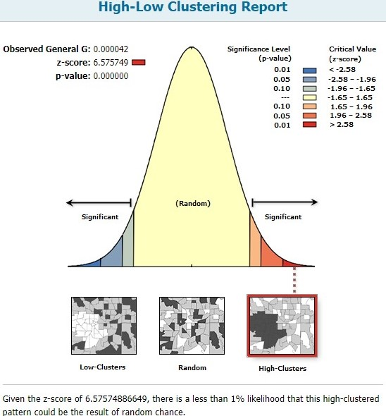
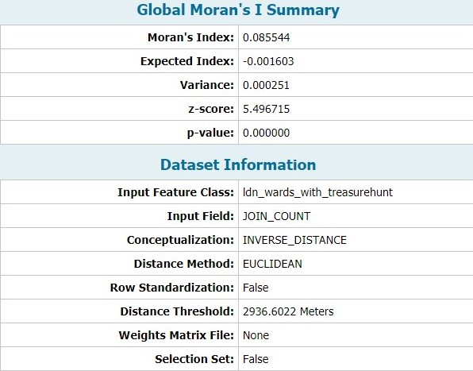
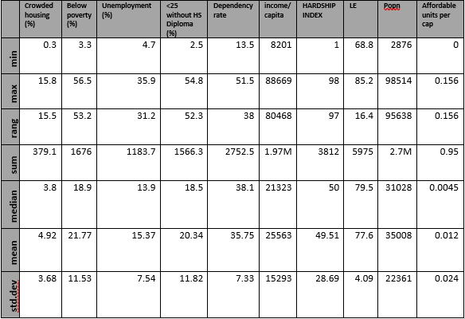

# Assessment Part 1 
### Written evaluation (Word Count: 597)

This research selected 2015 sub-region data from Afghanistan, reported by the Department of Health Surveys [@spatial_data_repository_2015_2015]. With this data, the spotlight was shone on the potential spatial correlation between female literacy and household access to electricity, which is considered a measure of modernisation and development [@desai_urbanisation_2012]. QGIS and R were used to explore, visualize and compare the female literacy rates and household access to electricity, across sub-regions in Afghanistan. It is critical to remind readers that this study does not intend to prove causation but is solely intended to visualize a potential spatial correlation. 

This study began by using QGIS to read shapefiles downloaded from the Spatial Data Repository. However, there were many variables/fields with incomplete data. These fields include the maternal mortality rates and HIV-prevalence indicators. Missing values were indicated by '9999'. Since the fields of interest (female literacy: 'EDLITRWLIT', household electricity: 'HCELECHELC') were complete, no interpolations were required to fill in missing data. Following the data inspection, 2 identical maps were placed in the workspace to produce a choropleth map visualising two variables. To ensure that the map clearly portrays the correlation in question, the sub-regions with less than 50% of households with electricity were highlighted through rule-based graduated symbology. Bins of observations were created with the Jenks natural breaks classification. Transparencies and symbols were adjusted and the QGIS map was generated, with appropriate map elements. Finally, the map was embedded into Rmarkdown [@dennett_producing_2018].

The initial R attempt to produce the map utilised the 'tmap' R-package. However, the end-product was considered to be unsatisfactory on aesthetic and intuitive levels. Making fine adjustments required an in-depth knowledge of the extensive R-package documentation. After consulting with peers and an appreciation of the 'leaflet' package through Dennett [@dennett_practical_2018], a second attempt was made to maximise the potential of the 'leaflet' package. Bins of observations were determined by calculating quantiles instead of jenks, and other map elements were added to produce a more comprehensive and intuitive map. This created an interactive map with pop-up labels and multiple overlays by using the 'addLayersControl' function [@rstudio_leaflet_2016]. This allows the user to select the variable to be visualised, to zoom-in, and to choose the type of basemap (ESRI gray canvas / topographic map). 

With the maps complete, it is crucial to evaluate the limitations and uncertainty of the data used. Although we do not have the data collection methodology, we can speculate that one probable limitation is the geo-political situation within Afghanistan which could lead to the under-reporting of female literacy rates, as well as compromise the accuracy because of security risks in data collection. These uncertainties should be considered in further analysis.
The process of using two different approaches to produce a map researching the same question has brought a keener understanding of the benefits and drawbacks of each approach. The ever-necessary process of cleaning, processing and analysing data is significantly easier with R-packages. However, minute adjustments in producing a map are easier in QGIS because of the intuitive and friendly user-interface, which ensures a smooth navigation and provides immediate updates with each change. For R, the smallest of changes require the cartographer to be aware of the intricate R documentation for each function within each package, before needing to run chunks of code again. This can be a time-consuming endeavour, albeit becoming more intuitive with experience and practice. Overall, there are advantages and disadvantages with each platform, but these serve to emphasise their complementarity. The choice of program should depend on the structure of the data, the cartographer's task, experience and preference. 

```{r Embedding Map generated by QGIS, echo=FALSE}
library(knitr)
knitr::include_graphics('afghan_latest.jpg')
```
##### (For an idea of how Part 1 looked with the Leaflet map, refer to http://rpubs.com/ucfnaws/435765.)

```{r R-generation of Map, eval=FALSE, include=FALSE}
library(plotly)
library(maptools)
library(RColorBrewer)
library(classInt)
library(OpenStreetMap)
library(rJava)
library(sp)
library(rgeos)
library(tmap)
library(tmaptools)
library(sf)
library(rgdal)
library(geojsonio)
library(ggplot2)
library(shiny)
library(shinyjs)
library(dplyr)
library(tidyverse)
library(maps)
library(leaflet)
library(sf)
library(sp)
library(magrittr)

##### Reading shapefile used in QGIS into R ####
afghanmap <- read_shape("sdr_subnational_data_dhs_2015.shp", as.sf = TRUE)
afghan_lowelec <- afghanmap %>% filter(HCELECHELC<50)

# Making maps
afghan_osm <- read_osm(afghanmap, type = "esri", zoom = NULL)
```

```{r Generation of map with TMAP, eval=FALSE, include=FALSE}
##### Plotting with TMAP -- I did not find the map produced with this package very aesthetic and intuitive. Thus, I tried Leaflet in the next section instead.  #####
tmap_mode("plot")
tm_shape(afghanmap) +
  tm_polygons("EDLITRWLIT",
             style = "jenks",
             palette = "YlOrBr",
             midpoint = NA,
             border.col = "black",
             border.lwd = 0.5,
             title = "Female literacy (%)") +
  tm_text("DHSREGEN", size = 0.4, col = "black") +
tm_shape(afghan_lowelec) +
  tm_fill("HCELECHELC", alpha = 1, title = "Households with electricity") +
  tm_borders(col="black",lwd=2.0) +
  tm_text("DHSREGEN", size = 0.4, col = "black")
```

```{r Generation of map with Leaflet, eval=FALSE, include=FALSE}
##### Plotting with LEAFLET #####
library(leaflet)
afghanmapSP <- afghanmap %>%
  st_transform(crs = 4326) %>%
  as("Spatial")
afghan_lowelecSP <- afghan_lowelec %>%
  st_transform(crs = 4326) %>%
  as("Spatial")

breaks<-classIntervals(afghanmap$EDLITRWLIT, n=5, style="quantile")
breaks <- breaks$brks

breaks1 <- classIntervals(afghan_lowelec$HCELECHELC, n=5, style="quantile")
breaks1 <- breaks1$brks

pal <- colorBin(palette = "OrRd", 
                domain = afghanmapSP$EDLITRWLIT,
                bins = breaks,
                reverse = TRUE)

pal1 <- colorBin(palette = "Greys",
                 domain = afghan_lowelecSP$HCELECHELC,
                 bins = breaks1,
                 reverse = TRUE)

leaflet() %>%
  addPolygons(data = afghanmapSP, 
              stroke = FALSE,
              fillOpacity = 0.8,
              smoothFactor = 0.5,
              fillColor = ~pal(EDLITRWLIT),
              popup = ~DHSREGEN,
              group = "Female Literacy rates"
  ) %>%
  addLegend(data = afghanmapSP,
            "bottomright",
            pal = pal,
            values = ~EDLITRWLIT,
            title = "Female Literacy rates (%)",
            opacity = 1,
            group = "Female Literacy rates") %>%
  addProviderTiles("Esri.WorldGrayCanvas", group = "Light basemap") %>%
  addProviderTiles("Esri.WorldTopoMap", group = "Topo basemap") %>%
  addPolygons(data = afghan_lowelecSP,
              stroke = TRUE,
              color = "black",
              weight = 3,
              fillOpacity = 1,
              smoothFactor = 0.5,
              fillColor = ~pal1(HCELECHELC),
              popup = ~DHSREGEN,
              group = "Sub-regions with <50% Households with electricity"
  ) %>%
  addLegend(data = afghan_lowelecSP,
            "topright",
            pal = pal1,
            values = ~HCELECHELC,
            title = "Sub-regions with <50% Households with electricity",
            opacity = 1,
            group = "Sub-regions with <50% Households with electricity") %>%
  addLayersControl(
    baseGroups = c("Light basemap", "Topo basemap"),
    overlayGroups = c("Female Literacy rates","Sub-regions with <50% Households with electricity"),
    options = layersControlOptions(collapsed = FALSE)
  )
```
# Assessment Part 2: Spatial Analysis Methodologies, based on 2016 Team 7 Route

```{r loading libraries, eval=FALSE, include=FALSE}
library(tmap)
library(geojsonio)
library(magrittr)
library(dplyr)
library(RColorBrewer)
library(rgdal)
library(tidyverse)
library(ggplot2)
library(ggmap)
library(OpenStreetMap)
library(sf)
library(sp)
library(leaflet)
library(geojson)
library(RCurl)
library(RJSONIO)
library(plyr)
library(spatstat)
library(MASS)
library(maptools)
library(GISTools)
library(rgeos)
library(tmaptools)
library(raster)
library(fpc)
library(mapview)
```

### Answers to Problem Set Questions (Excluded from Word Count)

Q1: Distance travelled by Team 7  =  46.604 km.

Q2: Team 7's route was with the 100m buffer of 22 Tube stations.

Q3: Team 7's total score achieved was 62 points, based on the 2016 scoring sheet. It came within the 300m buffer of 17 out of the 50 Treasure hunt locations. 

Q4: Team 7 passed through 30 out of 625 wards. Of these 30 wards, the lowest male life expectancy was 75.05 (Tower Hamlets - Weavers), while the highest male life expectancy was 84.31 (City of London).

Q5: The average male life expectancy was 78.77, while the average female life expectancy was 84.09. 

Q6: The CASA treasure hunt locations were not randomly or uniformly distributed. Instead, they were highly clustered, and concentrated. 

Based on the High/Low Clustering Getis-Ord General G test implemented on ArcMap, the z-score was 6.576. Based on Moran's-I Spatial Autocorrelation test implemented on ArcMap, the z-score was 5.497. 

These large z-scores and small p-values lead us to reject the hypothesis that the treasure hunt locations were truly random, at all conventional significance levels. There is less than 1% probability that the concentrated pattern is truly random. 


```{r Embedding Spatial autocorrelation results, echo=FALSE}
library(knitr)


```

### Critical commentary (Word Count: 600 Words)

##### Data Preparation

I set out to use R for this assessment. I used the dataset for the 2016 Team 7 route, the hunt addresses and scoring data provided through the Practical 7 instructions, because I was unable to geocode the addresses. The London Wards shapefile I used was from work done in previous weeks. I looked through the 'huntaddresses' csv file and noticed that one of the addresses (King's Cross Platform 9 ¾) was in the United States, so I manually changed the coordinates of that address. I proceeded to convert all the files from SP to SimpleFeatures because it is crucial to ensure that they are of the same class. I decided on SimpleFeatures because it was the most versatile and compatible package. Furthermore, I set the coordinate reference system to the British National Grid projected coordinate system. 
However, I encountered problems with the projection systems on R - the projection systems of the route and London Ward layers were different from the projection systems of the 'huntaddresses' and tube stations layers. Because of these challenges, I moved my analysis to ArcGIS, by writing all the files I had prepared so far into shapefiles that could be read on ArcGIS. I set the layers to a common Geographic Coordinate System GCS_OSGB_1936, and the British National Grid Projected Coordinate System, with the Project tool in the Data Management toolbox. Then, I could proceed with spatial analysis. 

##### Methodology and analysis

The first question was answered through R with the 'st_length' command, because the SimpleFeatures dataframes considered had similar projections. The rest of the questions were answered with ArcGIS. 
With the Buffer tool in the Analysis toolbox, I created 100m buffers around all the tube stations. Using the Intersect tool in the same toolbox, I calculated how many buffers the route had intersected. I noticed that there was double counting of both King's Cross and Kings Cross St Pancras stations. I used the 'Find identical' and 'Delete identical' tools in the Data management toolbox to find and remove duplicates in the output. This same workflow was replicated for Questions 3-5. To find the maximum, minimum and average life expectancies, I looked at the statistics and sorted the field in the attribute table. This was a shortcut, instead of summarizing the attribute table.
To assess the spatial autocorrelation of the hunt addresses I ran two pattern analyses in the Spatial Statistics toolbox. I used the Getis-Ord General G and the Moran's I tests, which showed that the probability that locations were randomly distributed were almost 0. However, the z-scores and associated p-values depend on the test and the conceptualization of spatial relationships specified. In this instance, I used 'inverse distance', with the Euclidean distance method based on the figure below.

```{r echo=FALSE}
library(knitr)

```

##### Reflections

We must ensure that the coordinates after geocoding are correct, before any spatial analysis. Outputs in ArcGIS (and in R) should always be assessed and checked for duplicates, and subsequently removed. For this assessment, I used the Planar Euclidean measure of distance, rather than Spherical measurements because I was dealing with a relatively small geographic area in London.  I was aware of the methods in R to solve these problems, such as the st_buffer, st_within and st_intersects commands in the 'sf' package. However, the challenges with the projection systems prompted me to use ArcGIS instead. Although I could have returned to R after resolving the problem on ArcGIS, I decided to continue because of my familiarity with the software. Nonetheless, I acknowledge the merit in using R, especially with larger datasets, iterative processes (greater flexibility than ArcGIS's Model Builder) and for aesthetic purposes.

```{r Preparing Data for coursework, eval=FALSE, include=FALSE}
# 2016 Team 7 Route
hunt <- geojson_read("https://www.dropbox.com/s/wa2ip35tcmt93g3/Team7.geojson?raw=1",
                     method = "web",what = "sp")

tmap_mode("view")
tm_shape(hunt) +
 tm_lines(col = "green", lwd = 4)

huntSF <- st_as_sf(hunt)

huntaddresses <- read_csv("https://www.dropbox.com/s/v66l4cx7aia9jlo/huntLocations.csv?raw=1")

# code here lifted directly from - https://gist.github.com/josecarlosgonz/6417633
# highlight this whole block and create this function to access the Google Places API
url <- function(address, return.call = "json", sensor = "false") {
 root <- "https://maps.google.com/maps/api/geocode/"
 u <- paste(root, return.call, "?address=", address, "&sensor=", sensor, sep = "")
return(URLencode(u))
} 

# highlight this whole block and create this function to geocode some places just from a random # list of treasure hunt locations
geoCode <- function(address,verbose=FALSE) {
if(verbose) cat(address,"\n")
 u <- url(address)
 doc <- getURL(u)
 x <- fromJSON(doc,simplify = FALSE)
if(x$status=="OK") {
 lat <- x$results[[1]]$geometry$location$lat
 lng <- x$results[[1]]$geometry$location$lng
 location_type <- x$results[[1]]$geometry$location_type
 formatted_address <- x$results[[1]]$formatted_address
return(c(lat, lng, location_type, formatted_address))
 Sys.sleep(0.5)
 } else {
return(c(NA,NA,NA, NA))
 }
}
# now use the geoCode() function (which calls the URL function) to geocode our list of places

# for loop to cycle through every treasure hunt location
i=1
for(i in 1:nrow(huntaddresses)){
# Every nine records, pause 3 seconds so that the API doesn't kick us off...
if(i %% 5 == 0) Sys.sleep(3)
# now create a temporary list of useful elements
 tempdf <- as.list(geoCode(huntaddresses[i,1]))
# and write these back into our dataframe
 huntaddresses[i,3] <- tempdf[1]
 huntaddresses[i,4] <- tempdf[2]
 huntaddresses[i,5] <- tempdf[4]
}
# rename the columns
names(huntaddresses) <- c("Location","Points","lat","lon","GoogleAddress")
head(huntaddresses)

# unable to get the API key to work, use dropbox link instead. 
huntaddresses <- read.csv("https://www.dropbox.com/s/2cbu2ux9ddy9c0l/huntaddresses.csv?raw=1")
head(huntaddresses)
write.csv(huntaddresses, "huntaddresses.csv")
# Preparing London wards from data merged in previous weeks of the Course. 
LondonWards <- readOGR("C:/Users/awws9/OneDrive/Documents/UCL MSc SCUA/MT/GIS/Coursework2/ldn_ward_data.shp")

# Converting data to sf and similar BNG coordinate systems

BNG = "+init=epsg:27700"
WGS = "+init=epsg:4326"

LondonWardsBNG <- spTransform(LondonWards, BNG)

huntBNG <- spTransform(hunt, BNG)
tmap_mode("view")
tm_shape(huntBNG) +
 tm_lines(col = "green", lwd = 4)

crs(LondonWardsBNG)
crs(huntBNG)

LondonWardsSF <- st_as_sf(LondonWardsBNG) %>% st_set_crs(BNG)

huntBNG_SF <- st_as_sf(huntBNG) %>% st_set_crs(BNG)
tmap_mode("view")
tm_shape(huntBNG_SF) +
 tm_lines(col = "green", lwd = 4)

huntaddresses_df <- as.data.frame(huntaddresses)
xy <- huntaddresses_df[,c(4,3)]
huntaddresses_sp <- SpatialPointsDataFrame(coords = xy, data = huntaddresses_df)
huntaddresses_sf <- st_as_sf(huntaddresses_sp, coords = c("lon","lat")) %>% st_set_crs(BNG)
plot(huntaddresses_sf)
```

```{r Part 1 Questions, eval=FALSE, include=FALSE}

route_dist <- st_length(huntBNG_SF)
print(route_dist)

# Total distance travelled by Team 7 = 46.604km
```

# Part 3: Mini-research Project 
(Word Count: 1799)

##### Research aim

The objective of this research was to explore the relationship between socioeconomic indicators and the number of affordable housing units per capita in Chicago, with community areas (CAs) being the geographical unit of analysis.

##### Introduction and literature review

The curiosity in this research was piqued by an interest in how housing policies responded to growing urban poverty. There are positive effects of housing stability on poverty reduction [@cunningham_reduce_2016] because it contributes to the living conditions and life chances of households [@tunstall_links_2013]. However, housing policies often fall short in addressing poverty because of the inadequate increase in affordable housing supply [@crisp_tackling_2017]. This can be attributed to the increasingly popular Mixed-income (or inclusionary) housing programmes in the US [@kalugina_affordable_2016], which mandated housing developments to have units to accommodate various income classes. This could potentially explain the presence of affordable housing units in CAs with high income/capita levels. Furthermore, affordable housing policies tend to be guided by 'opportunity indices', which implies that neighbourhoods with the most concentrated opportunities for upward mobility are favoured for mixed-income housing developments [@silverman_siting_2017]. This was indeed true in the context of Chicago, as the mixed-income housing sites depended on the presence of quality schools, accessibility and other public assets [@city_of_chicago_affordable_2014]. However, such determinants of opportunity mapping could lead to new developments being skewed against CAs with high poverty or hardship indices lacking such amenities. Selection-bias arises because these high-quality amenities are more likely to be in CAs that are better-off. Although Chicago has established 133 'Opportunity zones' based on unemployment and poverty rates, its incentives are tax-based to encourage investment [@city_of_chicago_city_2018-1], rather than to explicitly promote affordable housing. 

We studied the prevalence of the inadequate targeting of affordable housing projects by exploring the relationship between the affordable housing units/capita and the spatial distribution patterns of Chicago's key socioeconomic indicators. In the next section, we discuss the approach towards the data obtained from the City of Chicago's database, and the types of spatial analyses conducted. These include the spatial autocorrelation across our variables, and a Geographically-weighted Regression (GWR) to identify the variables which have a statistically-significant relationship with the affordable housing units/capita. This project culminated in a Shiny application which identifies spatial clusters (hot/cold-spots) within Chicago based on the range of socioeconomic indicators and visualises the GWR results.

##### Data cleaning/preparation/presentation

We cleaned and processed the data, and produced our output in R. We used 5 datasets (2018 community area boundaries, 2012 socioeconomic indicators, 2010 life expectancy, 2010 population and 2018 affordable housing units) downloaded from the City of Chicago's database [@city_of_chicago_city_2018], which included csv and shapefile formats. After removing NAs and ensuring that the data are in the right classes, we joined these 5 datasets based on CAs. We used the 'sp' and 'sf' data classes interchangeably, because each class was necessary for certain functions. We used the 'sp' class to produce a spatial weights matrix and calculate the centroid coordinates of each community area. The centroids were necessary for defining the kernel bandwidth for the GWR. The coordinate reference system for the data we used was the WGS84 projection. Variables were transformed to consider per capita, rather than absolute levels. The table below shows the descriptive statistics of all the variables that we used in our analysis. 

```{r echo=FALSE}
library(knitr)

```

##### Methodology

Before commencing our spatial analysis, we defined neighbour relationships through Queen-contiguities, where all touching polygons are considered as 'neighbours'. With this definition of 'neighbours', we calculated the spatial weights matrix based on the globally standardised 'C' style through the 'nb2listw' R function [@bivand_nb2listw_2018]. We considered two methods in measuring spatial autocorrelation. We calculated the Local Moran's I and the Getis-Ord Gi* coefficients for each community area and each variable. 

Before carrying out the GWR, we conducted a stepwise regression in both directions, where the dependent variable was the affordable housing units/capita, and the regressors were all the other socioeconomic indicators of each community area. This was to identify the statistically-significant regressors that were related to our dependent variable. The result retained the federal poverty rate and the percentage of crowded housing (>1 person/room). The residuals from the stepwise regression model displayed the presence of spatial autocorrelation, with its Moran's I=0.14 (p-value=0.0047) and was statistically-significant. We then calculated the kernel bandwidth for the GWR model with 2 regressors and calculated their z-scores based on the GWR coefficient estimates, standard errors and means. This additional z-standardisation step was made to ensure that the final visualisation of the GWR coefficients were sensible. Since we had n=77 observations, we assumed that the Central Limit Theorem holds and there was convergence to a standard-normal distribution. The breaks in our z-score classification are based on conventional significance levels of 10% (1.645) and 5% (1.96). 

This Shiny application was developed with the aid of online tutorials, which were credited in the application. It features two tabs - one showing the interactive leaflet map and the other showing the data frame used in the analysis, which allows the user to filter and sort observations by field. The leaflet map visualises two methods of measuring spatial autocorrelation for all the variables considered, and the GWR z-scores. The interactive map allows the user to choose the results layer they would like to visualise and allows pop-ups to provide key information about the selected community area. 

##### Results

Shiny application: https://awswong-sg.shinyapps.io/GIS_coursework_shinyapp/.

In our analysis of the Local Getis-Ord z-scores, we observed statistically-significant hotspots of crowded housing in the Western part of Chicago. There were statistically-significant hotspots of households below poverty in the Western, Central and Southern CAs in Chicago, while cold-spots were observed in North Chicago. These patterns corresponded to the analysis of the composite indicator of Hardship, with hotspots in the Western and Southern CAs and cold-spots in the North-eastern CAs. In terms of the affordable housing units/capita, hotspots emerged in the central CAs by Lake Michigan, which partially overlapped with the hotspots described earlier.

Our stepwise regression model retained two statistically-significant variables. However, the percentage of crowded housing variable had a negative association with the number of affordable housing units/capita, while the percentage of households below the poverty line had a positive association, as expected. Nonetheless, the spatial autocorrelation among the residuals necessitated the use of a GWR model. 

For our crowded-housing percentage regressor, South-western CAs exhibited positive and statistically-significant association with the number of affordable housing units/capita, which partially overlapped with the hotspots of crowded housing. However, some Eastern CAs by Lake Michigan such as "Armour Square", "Oakland" and "Fuller Park" exhibited negative and statistically-significant association with the number of affordable housing units/capita. These three CAs are notable because they had high hardship scores.

For the percentage of households below poverty, there are positive and statistically-significant associations in wealthy CAs like "Loop" and "Near North Side", and negative and statistically-significant associations in Southwestern CAs. 

##### Discussion and limitations

Our GWR results were surprising because we expected generally positive associations between our socioeconomic indicators and the dependent variable. We assumed that affordable housing units were catered for the poor and targeted at areas with a high level of hardship. Instead, we found statistically-significant negative relationships between the number of affordable housing units/capita and our regressors of the percentage of households below the poverty rate, and the prevalence of crowded housing. These statistically-significant negative associations implied that higher levels of poverty/crowded housing were correlated with fewer affordable housing units/capita. While this seemed counter-intuitive, it was not entirely surprising when we consider the housing policies in the US which are driven by mixed-income housing projects and opportunity (amenities-related) indices rather than socioeconomic indices. 

The GWR model improved from the stepwise regression [@charlton_geographically_2009] because the R-squared increased from 0.267 to 0.757, implying that the GWR model explained 49 percentage-points more of the variance in the dependent variable. Furthermore, the GWR's residuals were not spatially autocorrelated based on the Moran's I coefficient (-0.13, p-value=0.96). 

However, there were limitations to the GWR model. Firstly, the datasets were from different years and may affect the comparability. However, since affordable housing provision requires time to respond to socioeconomic trends, our usage of 2018 housing data but older socioeconomic indicators should not warrant too much concern. Secondly, the Shapiro-Wilk test statistic (W=0.82, p-value=2.68e-8) suggests that we reject the null hypothesis that the residuals are normally distributed. Furthermore, the scatterplot of the residuals suggests that the homoskedasticity assumption might be violated. These limitations are crucial because they would invalidate the statistical inferences that we make from the GWR results because of the inaccurate standard errors. Nonetheless, these limitations can be potentially addressed by using the 'GWModel' R Package [@gollini_gwmodel:_2013]. We can either use a generalised or a robust GWR model to deal with the heteroskedasticity. Regardless, the analyses that were conducted were useful in the exploratory stage by bringing different datasets together to understanding its spatial distributions and relationships. It was not intended to suggest causality with a fully-robust model, or to propose specific policy recommendations. Still, it does encourage a deeper study and/or review of the decision-making and targeting process of affordable housing developments in US cities. The presence of selection bias within the current framework of inclusionary housing and opportunity mapping could compound the disadvantages in the community areas facing the most socioeconomic hardship. 

For the Shiny app, instead of preparing the results in a separate R-script, we could have programmed the server.R to conduct the spatial analyses instead, allowing the user to have a cleaner User-Interface, and better control over the visualised results. The Shiny app could also include interactivity between the leaflet map and data tabs, which allows the user to navigate back to the map from the filtered/selected community areas. 

##### Conclusion

This research aimed to analyse the spatial relationships between Chicago's socioeconomic indicators and the affordable housing units/capita. This is because of the nature of the affordable and inclusionary housing policy in the US that favours wealthier areas with better schooling, transportation and public amenities. We adopted two types of descriptive and exploratory spatial analyses by firstly studying the degree of spatial autocorrelation across our variables, and secondly conducting a GWR to explore the relationship between our dependent variable and our socioeconomic indicators (regressors) of interest. Our results show that the affordable housing units/capita in Chicago were not statistically-significant and positively correlated to the level of hardship each community area faced, based on household poverty rates and percentages of crowded housing as the proxies. These results were subsequently used to develop a Shiny application. We had acknowledged limitations in our methods, the GWR model and the Shiny application development. However, there is merit in how this research showed the dissonance between the outcomes of Chicago's affordable housing policy and the multiple socioeconomic indicators that contribute to the hardship in each community area. 

# References
